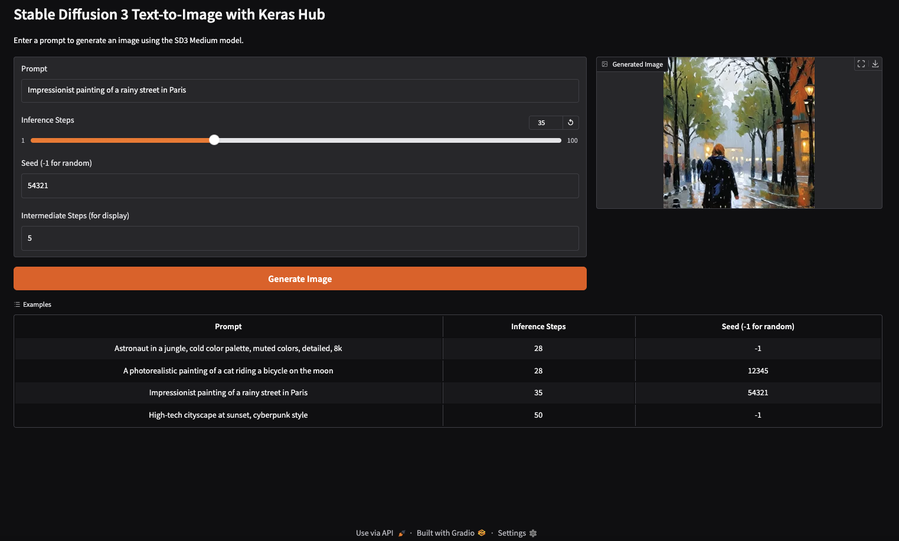
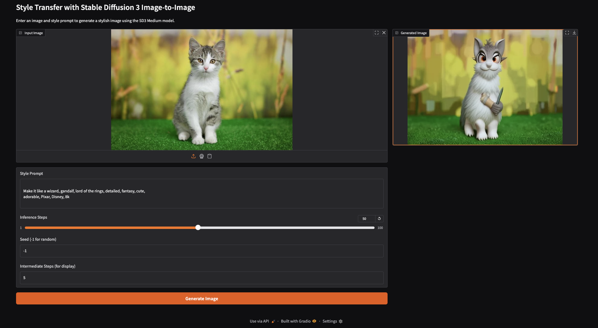

# Diffusion Models with Keras

This repository explores Denoising Diffusion Implicit Models (DDIM) and Stable Diffusion 3 (SD3) using Keras. It features:
1.  A complete from-scratch implementation of DDIM, including a training and inference pipeline for generating images using the CIFAR-10 dataset.
2.  Integration with pre-trained Stable Diffusion 3 models from Keras Hub for advanced text-to-image and image-to-image generation, complete with Gradio-based user interfaces.


## Overview

This project implements and showcases:

-   **Denoising Diffusion Implicit Models (DDIM):**
    -   A from-scratch DDIM architecture with a configurable U-Net backbone ([`architectures.py`](architectures.py), [`ddim.py`](ddim.py)).
    -   Implementation of forward and reverse diffusion processes.
    -   A training pipeline for the DDIM model on the CIFAR-10 dataset, featuring Exponential Moving Average (EMA) for model weights ([`training.py`](training.py), [`ddim.py`](ddim.py)).
    -   An inference pipeline to generate images using the trained DDIM model ([`inference.py`](inference.py)).
-   **Stable Diffusion 3 Integration:**
    -   Integration with pre-trained Stable Diffusion 3 models from Keras Hub ([`keras_hub`](https://keras.io/keras_hub/)).
    -   Scripts for text-to-image generation ([`text2image_sd3.py`](text2image_sd3.py)).
    -   Scripts for image-to-image (style transfer) generation ([`image2image_sd3.py`](image2image_sd3.py)).
-   **User Interfaces:**
    -   Interactive Gradio web UIs for both text-to-image ([`ui_text2img.py`](ui_text2img.py)) and image-to-image ([`ui_img2img.py`](ui_img2img.py)) generation using Stable Diffusion 3.
-   **Utilities:**
    -   Visualization tools for displaying image generation processes and results ([`utils.py`](utils.py)).

## Main Requirements
- tensorflow-2.18.0 
- keras-3.9.0
- keras-hub-0.19.1
- numpy-1.26.4
- matplotlib-3.10.0
- pillow-11.1.0
- gradio-5.28.0
- tensorflow-metal v (for Apple M series user)

## Setup

To set up the Python environment for this project using `venv` and install the necessary dependencies, follow these steps:

1.  **Ensure Python is installed**:
    This project is tested with Python 3.11. You can download Python from [python.org](https://www.python.org/downloads/) or use a version manager like `pyenv` or `asdf` to install a specific version. Make sure Python 3.11 (or a compatible version like 3.9+) is available in your PATH.

2.  **Navigate to your project directory**:
    Open your terminal and change to the root directory of this project.
    ```bash
    cd /path/to/your/diffusion-keras3
    ```

3.  **Create a virtual environment**:
    Name the virtual environment, e.g., `.venv`
    ```bash
    python3 -m venv .venv
    # Or, if 'python3' is not aliased, you might use 'python -m venv .venv'
    # Ensure you are using the desired Python version (e.g., Python 3.11)
    ```

4.  **Activate the virtual environment**:
    *   On macOS and Linux:
        ```bash
        source .venv/bin/activate
        ```
    *   On Windows (Command Prompt):
        ```bash
        .\.venv\Scripts\activate
        ```
    *   On Windows (PowerShell):
        ```bash
        .venv\Scripts\Activate.ps1
        ```
    Your terminal prompt should change to indicate that the virtual environment is active (e.g., `(.venv) your-prompt$`).

5.  **Install dependencies**:
    Ensure you have a [requirements.txt](http://_vscodecontentref_/1) file in your project root with the necessary packages.
    ```bash
    pip install --upgrade pip
    pip install -r requirements.txt
    ```
    If you are on a Mac with an Apple Silicon GPU and want to use Metal acceleration with TensorFlow, you might need specific TensorFlow packages. After installing the base requirements, you can install them:
    ```bash
    pip install tensorflow-macos
    pip install tensorflow-metal
    ```

After these steps, your environment should be ready to run the scripts in this repository. To deactivate the virtual environment when you're done, simply type `deactivate` in your terminal.

## Usage
### Training diffusion models from scratch
Train a new DDIM model on CIFAR-10:

```bash
python training.py
```

This will: 
- Load and preprocess the CIFAR-10 dataset
- Train the diffusion model for the configured number of epochs
- Save model checkpoints and generated samples during training

You can also run the training through Colab notebook: 
<a href="https://colab.research.google.com/github/ghif/diffusion-keras3/blob/main/training_ddim.ipynb" target="_parent"></a> 

### Inferencing
Generate new images using your trained model:

```bash
python inference.py
```

### Run Stable Diffusion with Gradio UI

#### Text-to-Image
To launch the Gradio UI for generating images from text prompts:

```bash
python ui_text2img.py
```


#### Image-to-Image
To launch the Gradio UI for applying styles to an input image based on a text prompt:

```bash
python ui_img2img.py
```


## Project Structure
- `architectures.py` - U-Net backbone implementation for DDIM
- `constants.py` - Model and training configuration for DDIM
- `ddim.py` - Core DDIM model implementation
- `training.py` - Training pipeline for DDIM on CIFAR-10
- `inference.py` - Inference pipeline for the trained DDIM model
- `utils.py` - Visualization and helper utilities
- `text2image_sd3.py` - Script for text-to-image generation using Stable Diffusion 3 (CLI)
- `image2image_sd3.py` - Script for image-to-image generation using Stable Diffusion 3 (CLI)
- `ui_text2img.py` - Gradio UI for text-to-image generation with Stable Diffusion 3
- `ui_img2img.py` - Gradio UI for image-to-image generation with Stable Diffusion 3

## Configuration
Key parameters can be configured in `constants.py`:
- Image dimensions and channels
- Model architecture (widths, block depth)
- Training parameters (batch size, learning rate, etc.)
- Diffusion process parameters
- Visualization settings

Configuration for Stable Diffusion 3 scripts (like image shape, model preset) can be found directly within the respective Python files.

## Model Checkpoints
Trained model checkpoints are saved in the `models` directory with timestamps.